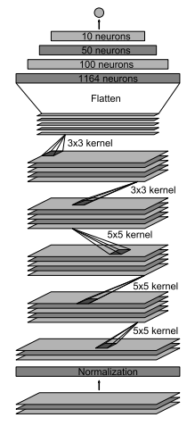

# Introduction
This project is done as a part of the Nanodegree - *Self-Driving Car Engineer* provided from Udacity. The outcome of the projct is, that a system with an artificial neuronal network is able to learn driving a track successfully by only getting human driving behaviour as input. And not only the track it has observed, it has to gerneralize to other tracks too. Images from cameras at the front (left/center/right) and steering angles are taken as input values. Collection of training data and testing is done within a simulator, which is provided by Udacity.
# Outline
1. Requirements
2. Files
3. Data Collection
4. Data Processing
5. Model Training
6. Model Testing
7. Conclusion

# 1. Requirements
- Python 3.5
- Environment [CarND-Term1-Starter-Kit](https://github.com/udacity/CarND-Term1-Starter-Kit/blob/master/README.md) provided by Udacity
- Car Simulator provided by Udacity
  - [macOS](https://d17h27t6h515a5.cloudfront.net/topher/2016/November/5831f290_simulator-macos/simulator-macos.zip)
  - [Linux](https://d17h27t6h515a5.cloudfront.net/topher/2016/November/5831f0f7_simulator-linux/simulator-linux.zip)
  - [Windows 32-bit](https://d17h27t6h515a5.cloudfront.net/topher/2016/November/5831f4b6_simulator-windows-32/simulator-windows-32.zip)
  - [Windows 64-bit](https://d17h27t6h515a5.cloudfront.net/topher/2016/November/5831f3a4_simulator-windows-64/simulator-windows-64.zip)
- [Sample data] (https://d17h27t6h515a5.cloudfront.net/topher/2016/December/584f6edd_data/data.zip) provided from Udacity
  - if you don't want to collect own training data with the simulator

# 2. Files
- model.py - The script used to create and train the model.
- drive.py - The script to drive the car. 
- model.json - The model architecture.
- model.h5 - The model weights.
- README.md - explains the structure of your network and training approach. 

# 3. Data Collection
### 3.1 Using the Simulator
The simulator can be used for data collection. The **Training Mode** is used for human driving and collecting and storing data. The ** Autonomous Mode** is used for testing the trained model. Both modes are available for both tracks.

TODO: Include image of the simulator

The simulator delivers and stores images of  left / center / right camera mounted at the front-window of the car. In the dataset (.csv) the following data is stored. 
* Links to stored images of the three cameras
* Steering-data
* Throttle-data
* Brake-data
* Speed-data

At the moment only images and steering-data are for training the model.
### 3.1 Using Data from Udacity
While collecting good training data is rather difficult, especially when using keyboard input to steer the car, Udacity provided a basis dataset (see chapter Requirements).

Finally it wasn't necessary to use own collected data to train the model. The basic dataset within data processing did the job.
# 4. Data Processing
The input data (sample data or own collected data) is shuffled and split up in training data and validation data. 15% of the data is used for validation. The validation data is NOT used for training at all.
No own testing data is split up because during development I found out that only testing in the simulator can give a reliable feedback if the final model works in a proper way.

Because of bad distribution within the training data the following tasks are made.
- Useage of images from left-camera and right camera
  - Steering angle correction of +/- 0.25
  - This amount was found out experimentally, in a real world example this can be calculated out of the geometry
- Flip images (vertical axis)
  - left-camera-image -> right-camera-image (with inverse steering angle)
  - right-camera-image -> left-camera-image (with inverse steering angle)
- Randomly adjustment of brightness
  - to avoid the model from getting biasd to lighter or darker conditions
- Change from RGB to HSV Color-Space
  
To avoid getting biasd to drive straight the data has been split up in three groups.
- Steer left ( x < -0.10 )
- No steering ( -0.10 <= x <= 0.1 )
- Steer right ( x < 0.10 )

Out of the groups the data is randomly selected while generating the training batch (by using fit_generator)

The model should only learn "reading" the track and shouldn't be influence by the hood of the car or the sky. Because of this, the images (160x320) are taken cut by TODO XXpx on top and XXpx on the bottom. This gives an image size of XXx320.
After the lot of test I found out that the image size can by shrinked without big disadvantages. So the images are shrinked from XXx320 to 64x64 before feeding into the model. Furthermore images are changed from RGB to HSV Color-Space because this gave better results.
IMPORTANT: Preprocessing has to be done with training and testing data. This preprocessing has to be included into drive.py too.

# 5. Model Training
The [paper](http://images.nvidia.com/content/tegra/automotive/images/2016/solutions/pdf/end-to-end-dl-using-px.pdf) from NVIDIA has strongly influenced the model, which was finally used for this project. 

The following picture is taken out of this paper.

The final architecture:
- Layer 1: Normalization of the input 
  - Input size: 64x64x3
  - Normalize the images within the range -1 to 1
- Layer 2: Convolution Layer
  - Number filters: 24
  - Filter Size: 5x5
  - Stride: 2x2
  - Mode: valid
  - L2 Regularization: 0.001
  - Activation: ReLu
- Layer 3: Convolution Layer 
  - Number filters: 36
  - Filter Size: 5x5
  - Stride: 2x2
  - Mode: valid
  - L2 Regularization: 0.001
  - Activation: ReLu
- Layer 4: Convolution Layer 
  - Number filters: 48
  - Filter Size: 5x5
  - Stride: 2x2
  - Mode: valid
  - L2 Regularization: 0.001
  - Activation: ReLu
- Layer 5: Convolution Layer 
  - Number filters: 64
  - Filter Size: 3x3
  - Stride: 2x2
  - Mode: same
  - L2 Regularization: 0.001
  - Activation: ReLu
- Layer 6: Convolution Layer 
  - Number filters: 64
  - Filter Size: 3x3
  - Stride: 2x2
  - Mode: valid
  - L2 Regularization: 0.001
  - Activation: ReLu
- Layer 7: Flatten
- Layer 8: Fully Connected Layer
  - Size: 100
  - L2 Regularization: 0.001
  - Dropout: 0.3
- Layer 9: Fully Connected Layer
  - Size: 50
  - L2 Regularization: 0.001
  - Dropout: 0.3
- Layer 10: Fully Connected Layer
  - Size: 10
  - L2 Regularization: 0.001
  - Dropout: 0.3
- Layer 12: Fully Connected Layer - Output Layer
  - Size: 1
  - L2 Regularization: 0.001

To avoid overfitting, 30% Dropout is used for all fully connected layers, except the last one, which is the output layer. L2 weight regularization applied to every layer. This helpful for getting a smoother driving, which is less snappy. 

Normalisation of images doesn't change the content of the images, but it makes it much easier for the optimization to proceed numerical and the variables should always have zero mean, if possible. This is done within the model.

For this model / project an Adam optimizer seems to be the best solution. To avoid jumping around a rather small learning rate (0.0001) has been used.

TODO epochs, e.g

The model for the artificial neuronal network is trained with [Keras](https://keras.io/) and a Tensorflow backend. In this project lots of data is needed. Because of this, it is not useful to keep the hole data in memory, as this was done in the last project. To get training and validation data fit_generator is used. Additionally random data augmentation is included in the data-generators.

# 6. Model Testing
For testing track 1 (within the simulator) has been used. This was successful, because the car was able to pass the track in a smooth way, without hitting any track limits.

TODO: Add track video

To show that the model generalizes to different tracks or conditions the second track (within the simulator) has been used. The model has **never** been trained on track 2. Anyway the car passes the track sucessfully.

TODO: Really? Add track video

# 7. Conclusion
The model, which was an adaption of the NVDIA-model, could clone the human driving behaviour and was able to generalize to tracks it has never seen while training. At the moment the model only can control the steering angle of the car. Trottle and brake, data could be used for further work.

While training an artificial neuronal network *Garbage in - Garbage out* really matters. Understanding the data and getting the balanced dataset are the key figures.
  

 
